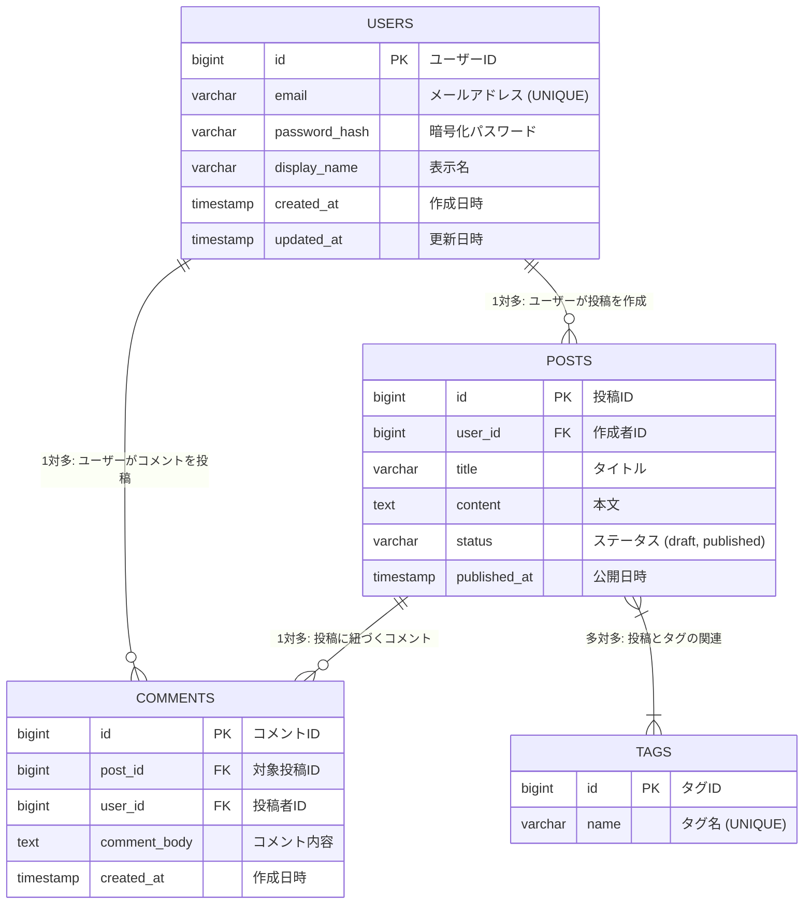

# ER図 & アーキテクチャ図 サンプル集

データベース設計とシステムアーキテクチャのテンプレート集です。

---

## 1. データベース設計 (ER図)

```mermaid
erDiagram
    USERS ||--o{ POSTS : "1対多: ユーザーが投稿を作成"
    USERS ||--o{ COMMENTS : "1対多: ユーザーがコメントを投稿"
    POSTS ||--o{ COMMENTS : "1対多: 投稿に紐づくコメント"
    POSTS }|--|{ TAGS : "多対多: 投稿とタグの関連"

    USERS {
        bigint id PK "ユーザーID"
        varchar email "メールアドレス (UNIQUE)"
        varchar password_hash "暗号化パスワード"
        varchar display_name "表示名"
        timestamp created_at "作成日時"
        timestamp updated_at "更新日時"
    }

    POSTS {
        bigint id PK "投稿ID"
        bigint user_id FK "作成者ID"
        varchar title "タイトル"
        text content "本文"
        varchar status "ステータス (draft, published)"
        timestamp published_at "公開日時"
    }

    COMMENTS {
        bigint id PK "コメントID"
        bigint post_id FK "対象投稿ID"
        bigint user_id FK "投稿者ID"
        text comment_body "コメント内容"
        timestamp created_at "作成日時"
    }

    TAGS {
        bigint id PK "タグID"
        varchar name "タグ名 (UNIQUE)"
    }
```

---

## 2. クラウドアーキテクチャ図 (architecture-beta)

```mermaid
architecture-beta
    group vpc(cloud)[Virtual Private Cloud]
    group public_subnet(internet)[Public Subnet] in vpc
    group private_subnet(server)[Private Subnet] in vpc
    group data_subnet(database)[Database Subnet] in vpc

    service user(internet)[End User]
    service alb(cloud)[Application Load Balancer] in public_subnet
    service app_server(server)[ECS Web/API Service] in private_subnet
    service aurora(database)[Aurora PostgreSQL] in data_subnet
    service redis(disk)[ElastiCache Redis] in data_subnet

    user:R --> L:alb
    alb:B --> T:app_server
    app_server:B --> T:aurora
    app_server:R --> L:redis
```
