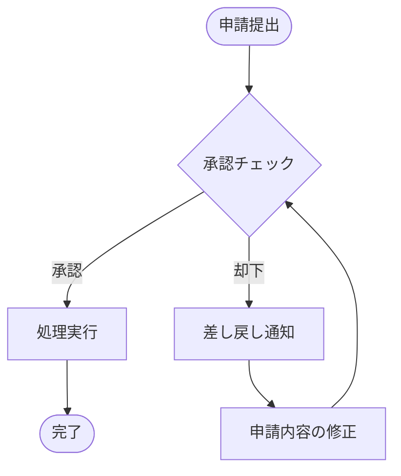
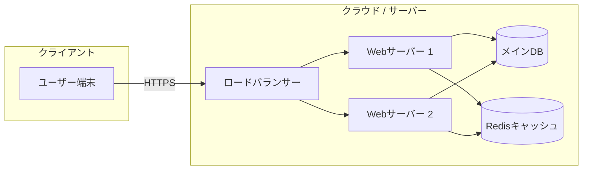
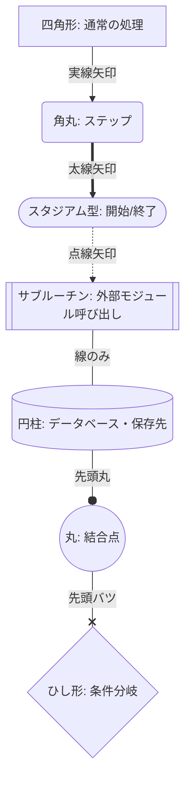

# フローチャート (Flowchart) サンプル集

コピペして利用できるフローチャートのテンプレート集です。

---

## 1. 基本的な承認ワークフロー

```mermaid
graph TD
    Start([申請提出]) --> Review{承認チェック}
    Review -- 承認 --> Approved[処理実行]
    Review -- 却下 --> Rejected[差し戻し通知]
    Rejected --> Revise[申請内容の修正]
    Revise --> Review
    Approved --> Finish([完了])
```

---

## 2. システム構成とデータ連携（サブグラフ）

```mermaid
graph LR
    subgraph クライアント
        User[ユーザー端末]
    end

    subgraph クラウド / サーバー
        LB[ロードバランサー]
        App1[Webサーバー 1]
        App2[Webサーバー 2]
        DB[(メインDB)]
        Cache[(Redisキャッシュ)]
    end

    User -->|HTTPS| LB
    LB --> App1
    LB --> App2
    App1 --> Cache
    App2 --> Cache
    App1 --> DB
    App2 --> DB
```

---

## 3. 各種ノード形状と矢印スタイルのチートシート

```mermaid
graph TD
    Node1[四角形: 通常の処理]
    Node2(角丸: ステップ)
    Node3([スタジアム型: 開始/終了])
    Node4[[サブルーチン: 外部モジュール呼び出し]]
    Node5[(円柱: データベース・保存先)]
    Node6((丸: 結合点))
    Node7{ひし形: 条件分岐}

    Node1 -->|実線矢印| Node2
    Node2 ==>|太線矢印| Node3
    Node3 -.->|点線矢印| Node4
    Node4 ---|線のみ| Node5
    Node5 --o|先頭丸| Node6
    Node6 --x|先頭バツ| Node7
```
