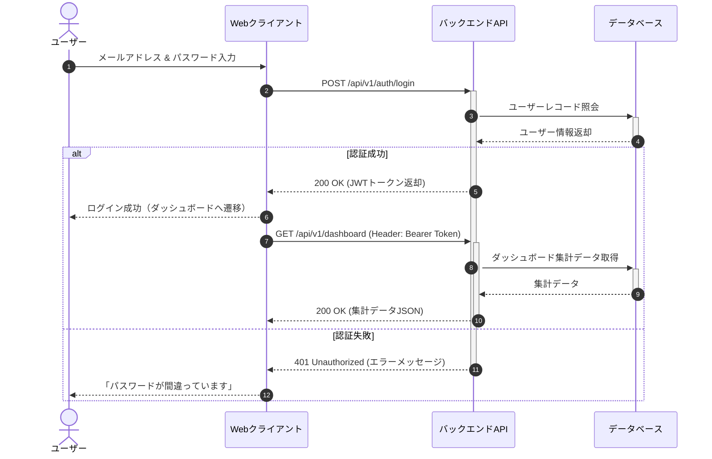
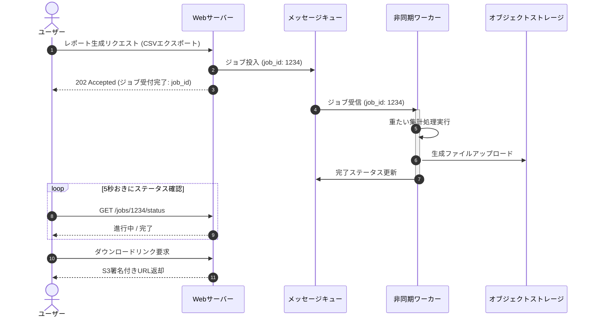

# シーケンス図 (Sequence Diagram) サンプル集

コピペして利用できるシーケンス図のテンプレート集です。

---

## 1. REST API 認証 & データ取得フロー

```mermaid
sequenceDiagram
    autonumber
    actor User as ユーザー
    participant Client as Webクライアント
    participant API as バックエンドAPI
    participant DB as データベース

    User->>Client: メールアドレス & パスワード入力
    Client->>+API: POST /api/v1/auth/login
    API->>+DB: ユーザーレコード照会
    DB-->>-API: ユーザー情報返却
    
    alt 認証成功
        API-->>Client: 200 OK (JWTトークン返却)
        Client-->>User: ログイン成功（ダッシュボードへ遷移）
        
        Client->>+API: GET /api/v1/dashboard (Header: Bearer Token)
        API->>+DB: ダッシュボード集計データ取得
        DB-->>-API: 集計データ
        API-->>-Client: 200 OK (集計データJSON)
    else 認証失敗
        API-->>-Client: 401 Unauthorized (エラーメッセージ)
        Client-->>User: 「パスワードが間違っています」
    end
```

---

## 2. 非同期ジョブ処理（並列処理とポーリング）

```mermaid
sequenceDiagram
    autonumber
    actor User as ユーザー
    participant Web as Webサーバー
    participant Queue as メッセージキュー
    participant Worker as 非同期ワーカー
    participant S3 as オブジェクトストレージ

    User->>Web: レポート生成リクエスト (CSVエクスポート)
    Web->>Queue: ジョブ投入 (job_id: 1234)
    Web-->>User: 202 Accepted (ジョブ受付完了: job_id)

    Queue->>Worker: ジョブ受信 (job_id: 1234)
    activate Worker
    Worker->>Worker: 重たい集計処理実行
    Worker->>S3: 生成ファイルアップロード
    Worker->>Queue: 完了ステータス更新
    deactivate Worker

    loop 5秒おきにステータス確認
        User->>Web: GET /jobs/1234/status
        Web-->>User: 進行中 / 完了
    end

    User->>Web: ダウンロードリンク要求
    Web-->>User: S3署名付きURL返却
```
